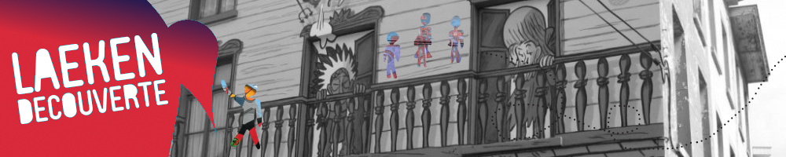
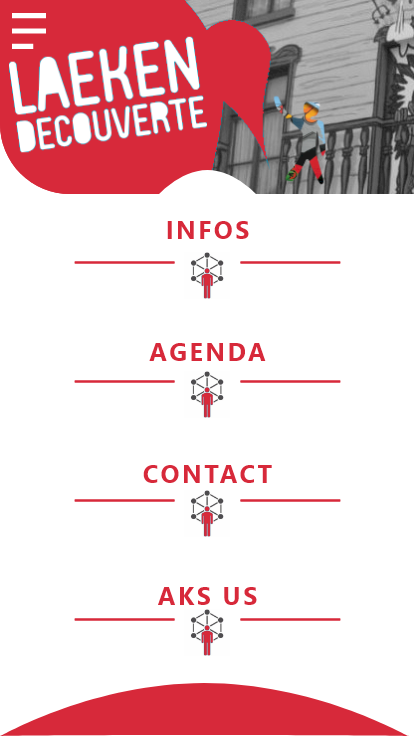
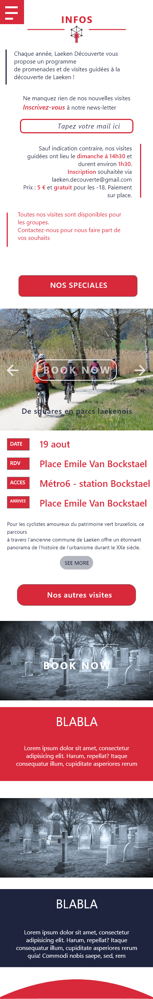
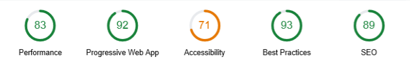

# Laeken Decouverte

- **Author:** Paul *"makemyA"* Henrot, Guillaume Kreit, Philippe Hennaux
- **About:** Réaliser un one pager pour l'ASBL Laeken Decouverte
- **Period:** *-Start: 23/07/2018-*
- **Place:** [BeCode](https://becode.org/) bootcamp @[Becentral](https://www.becentral.org/) buildings in Bruxelles

You can watch complete instructions [there](https://github.com/becodeorg/lovelace-2/tree/master/Projects/challenge-six-hours-team/)

You can watch the result [here](https://makemya.github.io/becode-AHOD/)

Prenez bonne note que la version desktop est significativement différente de la version mobile.

## Project Description

* **Objective?**

    Mettre en application les différentes techniques web vues et utilisées durant les 2 premiers mois de la formation Becode. Afin de jouer le jeu, le site a été complètement codé, dessiné à partir de zéro. Le but étant de valider les acquis en cours.

* **Outils**

Le travail a été produit avec les langages et outils suivants: 

1. Adobe Xd pour le mockup
2. visual studio code pour l'éditeur de code
3. html, bootstrap, sass, compass et javascript pour la partie front-end
4. upup.js et realfavicongenerator pour l'installation des composants PWA
5. Gimp pour les quelques retouches d'image et des logos

## **Step 1:** Réalisation du mockup

* Installation et découverte d'[adobe XD](https://www.adobe.com/be_fr/products/xd.html?sdid=8DN85NTM&mv=search&s_kwcid=AL!3085!3!275766221678!e!!g!!adobe%20xd&ef_id=WVHkkgAAABPjjjcs:20180705125233:s/)

L'attout premier de ce logiciel est qu'il est totalement **gratuit**. De plus il ne nécessite pas d'avoir des grandes bases en design pour commencer à s'amuser avec. Il existe également une forte communauté de designer utilisant ce programme. Beaucoup de ressources gratuites sont donc facilement à disposition.

* Initialisation du design

Avant de se lancer dans l'aventure il fût utile d'errer quelques temps sur le [site original](http://www.laekendecouverte.be/) de l'asbl pour y repérer les élements essentiels qui pourraient éventuellement  servir pour la conception du site.

Au premier coup d'oeil on peut remarqué que celui-ci est plutôt vieillot mais bien réalisé dans l'ensemble. Son plus gros défaut étant qu'il ne possède pas de version pour smartphone. En effet pas de responsive design à se mettre sous la dent.

Il n'y a donc pas le choix, il faut bel et bien le recommencer de zéro.

Après avoir sélectionné et retouché les quelques photos utiles disponibles sur le site, nous allons donc attaquer la partie Ui et Uix du projet. 

Etant donné qu'il s'agit ici d'un one pager, il semblait plus facile de commencer directement avec le programme proposé par adobe sans étape préalable.

Comme énoncé plus haut, le mockup a été réalisé sur base d'inspiration spontanée. N'étant pas graphiste de formation, il s'agissait d'un bon exercice pour évaluer ses compétences de base à ce sujet.

Etant donné que le site doit pouvoir être téléchargé en application PWA, il semblait judicieux de partir de l'approche Mobile first.

Afin de rajouter un peu de challenge, l'idée était de créer une impression visuelle différente entre la version téléphone et plus grands écrans mais en ne gardant qu'un fichier HTML pour le tout. 

La partie téléphone a donc été pensée avant tout comme une application avec un menu d'accueil permettant de faire des allers retours entre les différentes sections par un jeu de toggle("hide") en javascript.

Voici les esquisses réalisées:

Une version "d'essayage" est également disponible en suivant ce [lien](https://xd.adobe.com/view/5ed4349d-a489-4d7e-5fea-51837b9de1c9-28e5/)

## **Step 2:** Intégration du site

* Création de l'architecture des dossiers

Durant les 2 mois de formation, nous avons pu découvrir différents frameworks/librairies utiles à la création de sites internet. Dans ce cas-ci Sass/compass est utilisé comme compilateur de code css et les grid de bootstrap pour mieux gérer la composante responsive du projet.

N'utilisant pas encore de gestionnaire de frameworks, l'architecture des dossiers s'inspire fortement de la pensée [SMACSS](https://smacss.com/) afin de pouvoir réfléchir déjà à une façon de coder par module. Le but étant de pouvoir réutiliser des éléments de ce travail facilement à l'avenir ainsi que d'avoir une très bonne maintenance du code au cas ou cela serait nécessaire.

* Mobile First

Le Html a été pensé à partir du framework bootsrap. Par choix le responsive a été mis de coté dans un premier temps afin de se concentrer sur la version "application" pour téléphone.

Voici les étapes suivies dans l'odre:

1. **html** complet avec ajout des Id pour les sections et les boutons et des classes bootstrap pour la version mobile
1. **css** généré par le sass/compass. Déstructurer les éléments html dans différents fichiers partiel (**_nomdufichier.scss**) et création des premières variables (**$nomdelavariable**: "valeur de la variable") ainsi que des mixins.
1. **javascript** pour la gestion du dom. Essentiellement pour la gestion des évenements sur les boutons et pour cacher les sections quand cela était nécessaire. 
1. **animations Css** pour le coté un peu fun et la gestion de différents prompt à l'utilisateur
1. Installation des composantes nécessaires au **PWA**. L'outil ne proposant pas systématiquement le téléchargement de l'application en mode mobile, je me suis permis d'ajouter une animations de susbstitution indiquant à l'utilisateur comment la télécharger manuellement sur son mobile.

## **Step 3:** Vérification des bonnes pratiques

Pour vérifier le résultat, une analyse lightouse a été réalisée.

Quelques mofifications sont encore a apporter au projet pour rendre des performances optimales.

## Dificultés rencontrées

* Difficile d'utiliser pour la première fois le mix de tous les outils appris. Le sass n'est pas si simple à gérer sans une bonne expérience préalable à mon sens.
* Pas vraiment d'"assets" exploitable, toutes les photos du site original étant de très mauvaise qualité.
* Problème liés à l'installation du PWA. Celui-ci n'est pas demandé systématiquement à l'utilisarteur lors de la première utilisation. Création d'un CTA explicatif pour pallier à ce problème (voir l'icone téléphone qui s'agite au dessus du footer en version mobile).
* Difficultés liées à l'UI. L'objectif fixé étant de partir de zéro sans s'inspirer du travail d'autrui. L'exercice était très didactique vu que nous sommes dans un onjectif d'apprentissage.
* Difficultés liées à mixer 2 versions avec des navigations différentes en un seul html. (version mobile, avec des aller retour pour accéder aux différentes sections comme dans une application. Version desktop avec contenu plein avec gestion de la navigation par scroll et ancres)

## Merci et à bientôt